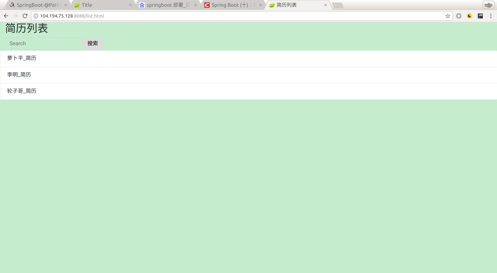
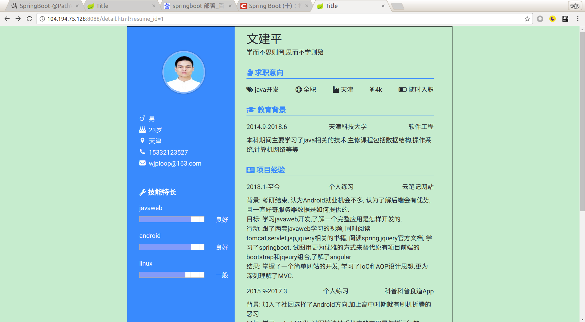
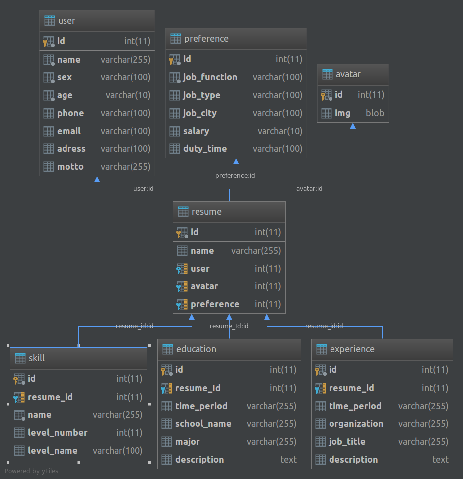

# 个人简历

## 介绍

个人简历使用html展现,数据从服务器中获取填充到html模板中.
数据完全分离于展示页面,可以直接修改数据库中的数据既可以得到另一份简历.

### 已实现功能:
*  简历列表展示
*  简历查询
*  展现简历详情1
*  上传本地图片修改头像

本应用已部署,点击[服务器](http://104.194.75.128:8088/list.html)即可体验

### 如下图:

### 数据库:

#### 技术使用:
* bootstrap
* jquery
* springBoot
* mybatis
* mysql

#### 开发环境:  idea

## 笔记:

由于头像文件较小,在数据库中直接存储图片,而非图片的url地址
当图片直接传送给客户端,使用Base64编码图片字节流,以json格式传送.
当上传图片给服务器,没有使用了form表单,(避免重新加载当前页面),在ajax中使用FormData来上传文件

前端中,flex布局很好用,需注意box-sizing属性
